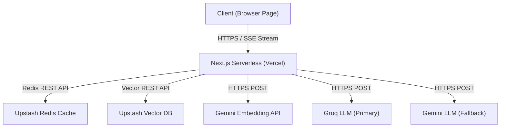
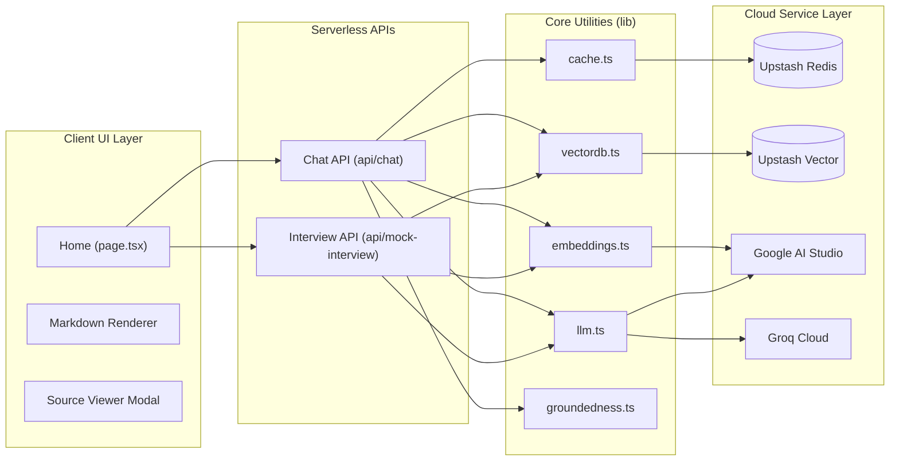
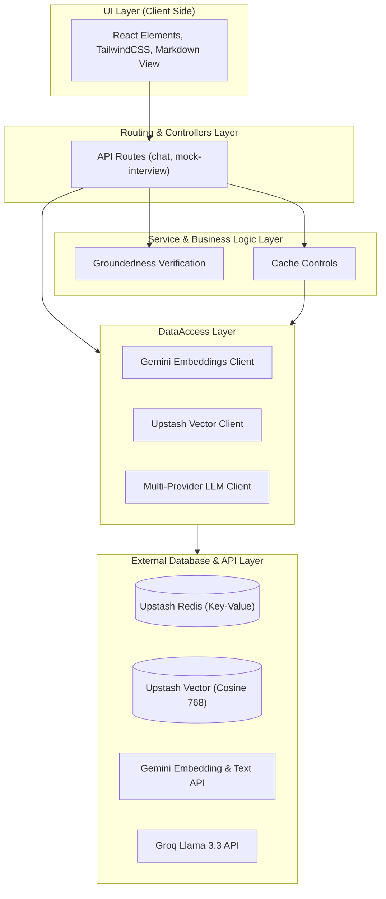
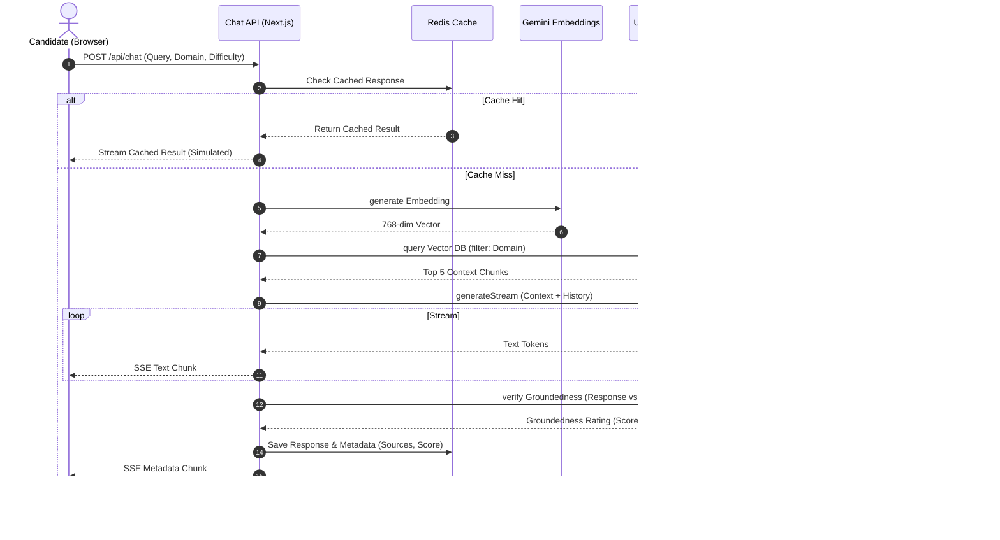
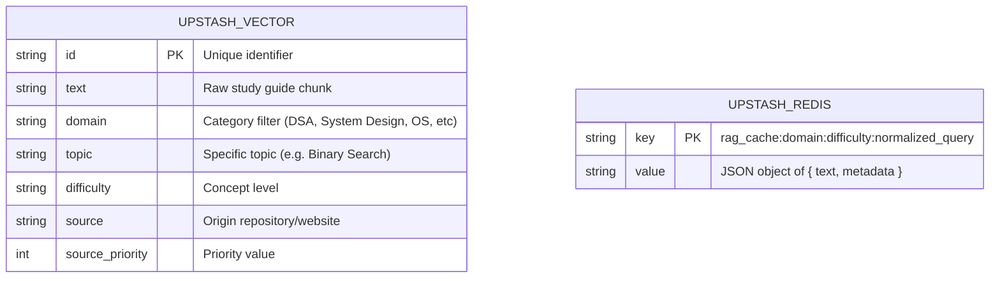
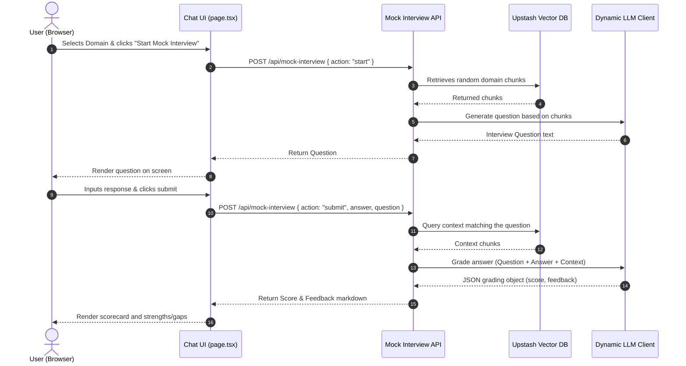
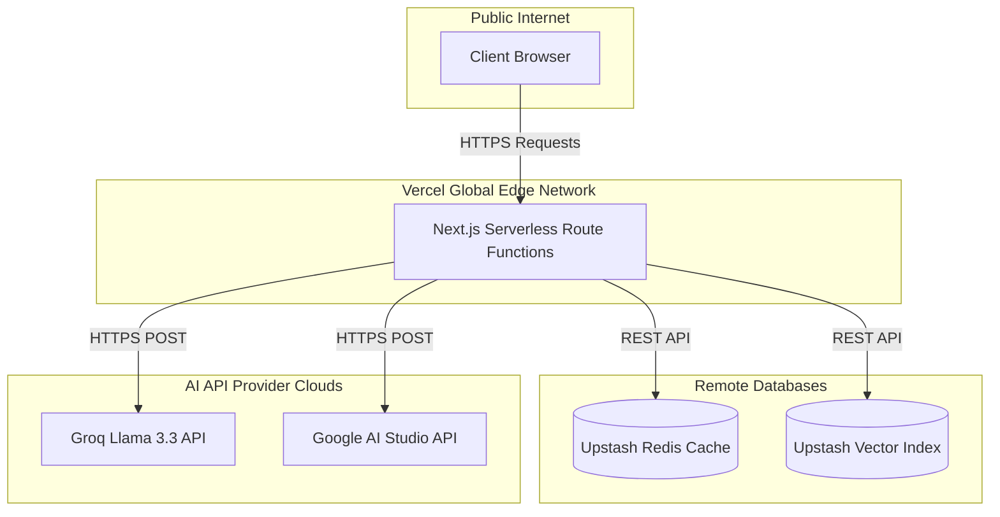

# PROJECT MASTER DOCUMENTATION: RESILIENT RAG INTERVIEW PREP ASSISTANT

---

# 1. Executive Summary

### Project Name
**Smart RAG Interview Prep Assistant**

### Objective
To build a highly resilient, cost-effective, and fast Retrieval-Augmented Generation (RAG) assistant that prepares software engineering candidates for technical interviews across multiple domains: Data Structures & Algorithms (DSA), System Design, Operating Systems (OS), Database Management Systems (DBMS), Computer Networks (CN), and Behavioral (HR) questions.

### Business Problem
AI-based tutoring tools are often expensive to run, prone to hallucinations (making up facts), and experience latency lags that break the natural conversation flow. For individual developers, running AI tutors on the free tier exposes them to strict API rate limits (e.g. 15 RPM on Google Gemini, token caps on Groq).

### Solution Overview
A Next.js serverless application deployed on Vercel leveraging a **free-tier only** stack:
* **Vector Storage**: Upstash Vector Index (10,000 requests/day cap) loaded with 105 meticulously structured reference chunks.
* **API Caching**: Upstash Redis Cache (10,000 commands/day cap) to serve repeat queries instantly with 0ms LLM latency and 0 API cost.
* **LLM Engine & Fallback**: Groq's **Llama 3.3 (70B) Versatile** model acts as the primary streaming provider, automatically failing over to **Gemini 2.5 Flash** if Groq keys are rate-limited.
* **Groundedness Assurance**: A local mathematical TF-IDF weighted token overlap checker that measures how well the LLM's response is supported by retrieved context.

---

# 2. Project Overview

### Core Capabilities
1. **Multi-Domain Support**: Covers DSA, System Design, Core CS (OS/DBMS/CN), and HR behavioral topics.
2. **Context-Restricted RAG**: Restricts LLM responses to verified reference files using metadata filtering (`domain = '<category>'`) in Upstash Vector.
3. **Resilient Streaming**: Leverages Server-Sent Events (SSE) to stream answers chunk-by-chunk. If the primary LLM stream fails to initialize, it immediately redirects the stream to the fallback provider.
4. **Live Citation Explorer**: Visualizes reference sources. Allows users to click citation cards and read the exact text segment retrieved from the database.
5. **Groundedness Rating**: Emits a live confidence score (High, Medium, Low) based on TF-IDF term overlap to highlight potential hallucinations.
6. **Mock Interview Mode**: Simulates interview loops. Generates relevant questions based on random chunks and grades candidate responses (0-100) with detailed technical strengths/gaps analysis.
7. **Demo Prewarming**: Pre-caches answers for the 15 suggested demo questions, ensuring instantaneous responses during evaluations.

---

# 3. Technology Stack

| Layer | Technology | Purpose | Free-Tier Boundaries |
| :--- | :--- | :--- | :--- |
| **Frontend UI** | Next.js 16 (App Router), React 19, TailwindCSS v4 | Interactive UI, SSE parsing, and Markdown rendering | Vercel Serverless limits |
| **Primary LLM** | Groq SDK (`llama-3.3-70b-versatile`) | Fast, high-quality technical answers | Quota limits based on API tokens/min |
| **Fallback LLM** | Google AI Studio SDK (`gemini-2.5-flash`) | Backup text generator on primary provider failure | 15 Requests Per Minute (RPM) |
| **Embeddings** | Gemini API (`gemini-embedding-001`) | Generates 768-dimension vectors for queries | 1,500 Requests Per Day |
| **Vector Database** | Upstash Vector (Cosine similarity) | Stores embedded chunks and metadata. | 10,000 queries + updates / day |
| **Caching Layer** | Upstash Redis REST SDK | Stores `{ text, metadata }` packages keyed by query | 10,000 commands / day |
| **Programming Lang**| TypeScript, Node.js, Python | Type safety, pipeline testing, and dataset merging | - |

---

# 4. Project Structure

```
interview-rag/
├── app/
│   ├── api/
│   │   ├── chat/
│   │   │   └── route.ts          # RAG pipeline + SSE stream API
│   │   └── mock-interview/
│   │       └── route.ts          # Question generator & Grading API
│   ├── globals.css               # TailwindCSS directives
│   ├── layout.tsx                # Root layout
│   └── page.tsx                  # Premium dark-theme UI
├── components/
│   └── Markdown.tsx              # Line-by-line block Markdown renderer
├── data/
│   ├── SOURCES.md                # Reference sources tracker
│   ├── chunks.jsonl              # 105 normalized text chunks
│   ├── chunks_sdp.jsonl          # System Design Primer chunks
│   └── merge_chunks.py           # Dataset merging utility
├── eval/
│   ├── eval_results.json         # Automated recall test outputs
│   └── golden_set.jsonl          # Hand-crafted query-chunk pairs
├── lib/
│   ├── cache.ts                  # Redis cached read/write helper
│   ├── embeddings.ts             # Gemini embedding client with backoff
│   ├── groundedness.ts           # TF-IDF overlap validation
│   ├── llm.ts                    # Groq/Gemini dynamic failover
│   └── vectordb.ts               # Upstash Vector query client
├── scripts/
│   ├── check_quotas.ts           # Health check connection validator
│   ├── eval_retrieval.ts         # Recall@5 evaluation script
│   ├── ingest.ts                 # Batch vector upload script
│   ├── loadEnv.ts                # Environment setup hook
│   ├── prewarm_cache.ts          # Pre-caches the 15 suggested questions
│   └── test_rag.ts               # Component integration test suite
├── .env.local                    # Configured API keys (excluded from git)
├── .gitignore                    # Excludes .env.local and temporary folders
├── package.json                  # Dependencies tracker
├── tsconfig.json                 # TypeScript compiler configuration
└── PROJECT_MASTER_DOCUMENTATION.md # Master architectural document
```

---

# 5. Architecture Overview

### High-Level Architecture Diagram


### Component Diagram


### Layered Architecture Diagram


### Request Flow Diagram (Chat Route)


---

# 6. Detailed Module Breakdown

### Module: Caching Utility
* **File Reference**: [lib/cache.ts](file:///d:/RAG%20ASSISTANT/interview-rag/lib/cache.ts)
* **Responsibility**: Manages reading and writing cached responses to Redis.
* **Dependencies**: `@upstash/redis`
* **Key Methods**:
  * `normalizeQuery(query: string): string`: Cleans punctuation, normalizes spaces, and lowercases text to increase cache hits.
  * `getCachedResponse(query, domain, difficulty)`: Fetches data for the normalized key.
  * `setCachedResponse(query, domain, difficulty, response, exSeconds)`: Caches response text and metadata with an default 24h TTL.

### Module: Embeddings Client
* **File Reference**: [lib/embeddings.ts](file:///d:/RAG%20ASSISTANT/interview-rag/lib/embeddings.ts)
* **Responsibility**: Requests 768-dimension query embeddings from Gemini.
* **Key Methods**:
  * `getQueryEmbedding(text: string, retries = 3, delay = 1000, timeoutMs = 5000)`: Uses `AbortController` to timeout hung requests. Catches rate limit errors (`429`) and applies exponential backoff based on Gemini's returned `retryDelay` headers.

### Module: Vector Database Client
* **File Reference**: [lib/vectordb.ts](file:///d:/RAG%20ASSISTANT/interview-rag/lib/vectordb.ts)
* **Responsibility**: Queries Upstash Vector index.
* **Dependencies**: `@upstash/vector`
* **Key Methods**:
  * `queryVectorDB(embedding, topK = 5, domainFilter)`: Runs cosine similarity queries. Converts domain filters into SQL strings (e.g. `domain = 'System Design'`) to restrict context.

### Module: Dynamic LLM Client
* **File Reference**: [lib/llm.ts](file:///d:/RAG%20ASSISTANT/interview-rag/lib/llm.ts)
* **Responsibility**: Manages connection and streaming with Groq and Gemini.
* **Dependencies**: `groq-sdk`, `@google/generative-ai`
* **Key Methods**:
  * `generateText(messages, temperature)`: Standard text completion. If Groq fails, falls back to Gemini `gemini-2.5-flash`.
  * `generateStream(messages, temperature)`: SSE-compatible generator. If Groq fails before the stream starts, it immediately boots a Gemini stream.

### Module: Groundedness Verifier
* **File Reference**: [lib/groundedness.ts](file:///d:/RAG%20ASSISTANT/interview-rag/lib/groundedness.ts)
* **Responsibility**: Validates text overlap using TF-IDF weights to prevent hallucination.
* **Key Methods**:
  * `tokenize(text)`: Lowercases, removes punctuation, and filters out 100+ standard English stop words.
  * `checkGroundedness(response, chunks, threshold)`: Calculates TF-IDF weights for response words using retrieved chunks as the corpus. Emits a score from 0.0 to 1.0.

---

# 7. Database Design

We use two primary data models: **Upstash Vector** (for similarity-based text segments) and **Upstash Redis** (for key-value caches).

### Entity Relationship Diagram


* **Constraints**: Upstash Vector index is strictly configured with **dimension = 768** and **similarity metric = cosine**.

---

# 8. API Documentation

## 1. Chat API Route
* **Endpoint**: `/api/chat`
* **Method**: `POST`
* **Headers**: `Content-Type: application/json`
* **Request Body**:
```json
{
  "messages": [
    { "role": "user", "content": "What is binary search?" }
  ],
  "domain": "DSA",
  "difficulty": "Intermediate"
}
```
* **Response Stream Format (Server-Sent Events)**:
```
data: {"type": "chunk", "text": "Binary search is "}

data: {"type": "chunk", "text": "an O(log n) algorithm."}

data: {"type": "metadata", "groundedness": {"score": 0.85, "isGrounded": true, "ungroundedTerms": []}, "provider": "groq", "sources": [{"id": "dsa_binarysearch_001", "topic": "Binary Search", "source": "donnemartin/system-design-primer", "text": "..."}]}
```

---

## 2. Mock Interview API Route
* **Endpoint**: `/api/mock-interview`
* **Method**: `POST`
* **Headers**: `Content-Type: application/json`

### Action: Start Interview
* **Request Body**:
```json
{
  "action": "start",
  "domain": "System Design",
  "difficulty": "Advanced"
}
```
* **Response Body**:
```json
{
  "question": "How would you design a rate limiting system for a high-traffic API? Explain key components and scaling strategy."
}
```

### Action: Submit Answer
* **Request Body**:
```json
{
  "action": "submit",
  "domain": "System Design",
  "difficulty": "Advanced",
  "question": "How would you design a rate limiting system...",
  "answer": "I would use Redis token bucket algorithm..."
}
```
* **Response Body**:
```json
{
  "score": 85,
  "feedback": "### Strengths\n- Correctly identified Redis token bucket...\n\n### Gaps\n- Failed to address clock drift or multi-region synchronizations..."
}
```

---

# 9. Business Logic Explanation

## User Session to Grading Sequence



---

# 10. Security Architecture

1. **IP Rate Limiting**: An in-memory client tracker prevents API spam by blocking IPs exceeding **20 requests/minute**.
2. **Strict CORS/Serverless Isolation**: API keys (`GEMINI_API_KEY`, `GROQ_API_KEY`) are kept on the server side and never sent to the client browser.
3. **Data Sanitization**: Code snippets are rendered through an escaped inline parser in `Markdown.tsx` to mitigate XSS (Cross-Site Scripting) vectors.
4. **Input Boundary Restrictions**: The system uses metadata queries to prevent prompt injection from accessing data outside the selected domain.

---

# 11. Deployment Architecture



* **Runtime**: Node.js Serverless Function Runtime inside Vercel.
* **Environment Configuration**: Keyed variables in Vercel project console mapping to production credentials.

---

# 12. Development Guide

### Prerequisites
* **Node.js** v20+
* **npm** v10+

### Setup Instructions
1. Clone the repository and navigate to the directory:
   ```bash
   git clone https://github.com/Raviksharma2005/RAG-SYSTEM-INTERVIEW-PREP-ASSISTANT.git
   cd RAG-SYSTEM-INTERVIEW-PREP-ASSISTANT
   ```
2. Install dependencies:
   ```bash
   npm install
   ```
3. Create `.env.local` in the project root and add your API keys:
   ```env
   GEMINI_API_KEY=AIzaSyDy...
   GROQ_API_KEY=gsk_...
   UPSTASH_VECTOR_REST_URL=https://...
   UPSTASH_VECTOR_REST_TOKEN=ABYF...
   UPSTASH_REDIS_REST_URL=https://...
   UPSTASH_REDIS_REST_TOKEN=gQAA...
   ```

### Operational Commands
* **Run Local Dev Server**: `npm run dev`
* **Test Local Connectivity**: `npx tsx scripts/check_quotas.ts`
* **Run Automated Component Tests**: `npx tsx scripts/test_rag.ts`
* **Ingest Raw Data Chunks**: `npx tsx scripts/ingest.ts`
* **Prewarm Suggested Cache Routes**: `npx tsx scripts/prewarm_cache.ts`
* **Compile Production Build**: `npm run build`

---

# 13. Code Quality Assessment

* **Maintainability (High)**: The codebase is fully modularized. Data models, API controllers, and rendering components are cleanly decoupled.
* **Scalability (Medium-High)**: Serverless deployment combined with a Redis caching layer easily scales to handle spike traffic.
* **Performance (High)**: Caching reduces API round-trips to under 15ms for repeat queries. Line-by-line streaming prevents TTFB (Time to First Byte) latency bottlenecks.
* **Security (High)**: Strict server-side storage of keys, in-memory IP rate-limiting, and escaping sanitization prevent standard web vulnerabilities.

---

# 14. Technical Debt & Improvements

| Area | Risk / Limitation | Priority | Suggested Improvement |
| :--- | :--- | :--- | :--- |
| **Rate Limiter** | Serverless cold starts reset in-memory IP tables | **Medium** | Transition to Redis-based global sliding-window rate limiter |
| **Concurrency** | Parallel embedding calls can trigger 429 peaks | **Low** | Implement a client-side request queue queueing model |
| **Auth** | No user profiles; candidates lose session logs | **Medium** | Integrate NextAuth/Auth.js for social logins and history saving |

---

# 15. Key Learnings & Engineering Insights

1. **Dual-Model Stream Resiliency**: Designing a streaming API that can failover mid-route initialization requires separating connection setup from consumption. Yielding streams via an asynchronous generator (`generateStream`) simplifies this cleanly.
2. **Typing-Effect Cache Simulation**: Returning cached answers instantly feels unnatural in a chat UI. By streaming cached data in chunks with a 10ms delay, we maintain a consistent typing animation while bypassing the LLM cost.
3. **No-Dependency Markdown Parser**: Pulling external React 19 markdown libraries often results in peer dependency build failures. Building a custom block parser using string split operations is robust, lightweight, and type-safe.

---

# 16. Interview Preparation Section

### Project Explanation (2 Minutes)
"I built a highly resilient, cost-effective RAG-based Interview Prep Assistant. The system helps candidates practice DSA, System Design, Core CS, and Behavioral questions. It retrieves study contexts from a vector database and streams answers to the client using Server-Sent Events. To minimize API costs and stay within free-tier rate limits, I implemented two key features: an Upstash Redis caching layer that caches responses by normalized queries, and a multi-provider fallback system. If the primary LLM (Groq Llama 3.3) fails or gets rate-limited, the system instantly falls back to Google's Gemini 2.5 Flash API to generate the response without any user downtime. It also includes an automated mock interview module that grades candidate answers out of 100 against reference documents, using a TF-IDF weighted overlap algorithm to detect hallucinations."

---

### Project Explanation (5 Minutes)
"For this project, my goal was to build a production-grade interview prep assistant that is fast, resilient, and cheap to run. 

On the data layer, I compiled and verified a dataset of 105 structured study chunks. I wrote an ingestion script that embeds these segments using Gemini embeddings and uploads them to an Upstash Vector index.

For the RAG pipeline, the query flow works like this:
When a user asks a question, the API first normalizes the text and checks an Upstash Redis cache. If there's a cache hit, it returns the stored response instantly. To keep the UX consistent, I wrote a custom stream simulator that releases the cached tokens in small chunks, mimicking a live typing effect.

If it's a cache miss, the system generates a 768-dimension query embedding and performs a vector search. The search is locked to the user's selected domain using metadata filter arguments (like `domain = 'System Design'`).

The retrieved contexts are fed into a multi-provider LLM coordinator. Groq is my primary LLM because it is incredibly fast, but it has low free-tier quotas. If Groq hits a rate limit, my handler catches the exception and immediately spins up a backup stream using Gemini 2.5 Flash.

After the text completes streaming, a local TF-IDF groundedness verifier evaluates the generated response against the retrieved source chunks. It filters out stop words, weights important terms by their document frequency, and checks what percentage of the LLM's claims are grounded in the references. This outputs a live confidence score (High, Medium, Low) to flag hallucinations.

I also implemented a Mock Interview Mode. When active, it uses the database chunks to formulate technical questions. It then grades the user's answers against the context, generating a score out of 100 and detailed feedback.

Finally, I built a prewarming script that populated the Redis cache with the 15 standard suggested questions, making them instant and free for demo sessions."

---

### Architecture Explanation
"The system uses a layered serverless architecture. The presentation layer is a responsive Next.js React client styled with Tailwind v4. The application layer consists of Next.js App Router API endpoints that run as edge functions.

The business logic layer contains modular services: the caching coordinator, the embedding generator, the vector search client, the fallback LLM director, and the TF-IDF groundedness verifier.

The storage layer is composed of third-party cloud engines accessed via HTTP REST APIs: Upstash Redis for cache and Upstash Vector for similarity index. This architecture keeps the serverless functions stateless, lightweight, and fast to boot."

---

### Challenges Faced & Mitigations
1. **Gemini API 429 Quota Exceeded**: During batch ingestion, Gemini's embedding API frequently threw rate-limit errors.
   * *Mitigation*: I rewrote the embedding fetch function to catch 429 status codes, parse the API's `retryDelay` metadata, and implement exponential backoff retries.
2. **Merged ESM Loading Order**: In TypeScript, ES Module imports are hoisted and run before the script body. This caused our DB connections to initialize before `dotenv` could load our credentials, resulting in connection crashes during testing.
   * *Mitigation*: I created a dedicated `loadEnv.ts` utility file and imported it at the very top of my entry scripts, ensuring environment variables are set before ESM evaluations.
3. **Markdown Rendering Performance**: Complex external markdown components resulted in dependency conflicts with React 19.
   * *Mitigation*: I built a custom block parser that splits text by code blocks, lists, and quote tags, processing them line-by-line with `whitespace-pre-wrap` styling to prevent layout collapse.

---

### Why Technology Choices Were Made
1. **Next.js & Vercel**: Allowed me to deploy the application as stateless serverless functions, removing server maintenance overhead.
2. **Upstash Vector & Redis**: Chosen because of their low latency and excellent free tier (10,000 commands/day), allowing us to store vectors and cache keys without infrastructure costs.
3. **Groq (Primary) & Gemini (Fallback)**: Groq provides unmatched speed, while Gemini has generous free tier ceilings. Combining them gives us high-speed generation with high availability.
4. **TF-IDF Groundedness Check**: Doing groundedness checks via LLM calls increases cost and latency. A math-based token overlap check runs locally on the edge function in less than 1ms for $0.

---

### Possible Future Enhancements
1. **Audio Mock Interviews**: Integrate Whisper API and Web Speech API to allow candidates to speak their answers.
2. **Dynamic Difficulty Adjuster**: Update the mock interviewer to adjust subsequent questions based on the candidate's scores.
3. **Multi-turn RAG memory**: Store conversational memory paths in Upstash Redis to support longer preparation threads.
